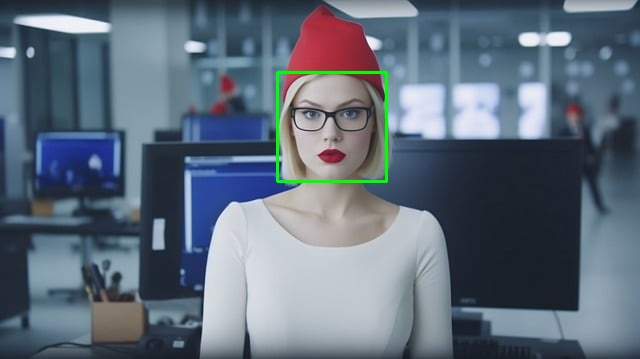

# Face Detection

This Python app detects faces in images using OpenCV's Haar cascades.

## Requirements

- Python 3.x
- OpenCV

## Usage

Run the script `app.py` with the following command:

```bash
python3 app.py <path/to/image> [result filename]
```

- `<path/to/image>`: Path to the input image.
- `[result filename]`: (Optional) Name of the output image file. If not provided, the detected faces will be displayed on the screen.

## Example

- Woman


- Face Detection



## License

This project is licensed under the AGPL-3.0 License. See the [LICENSE](LICENSE) file for details.
